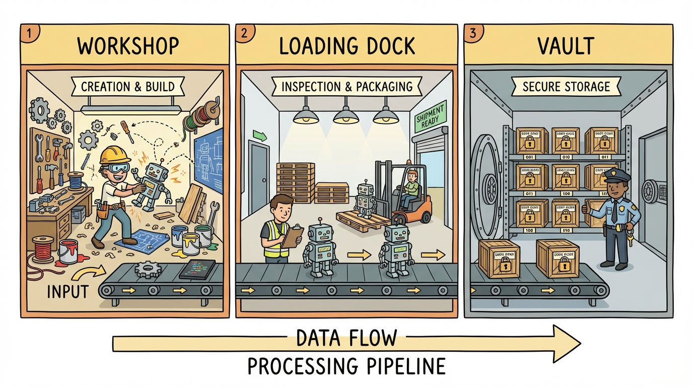
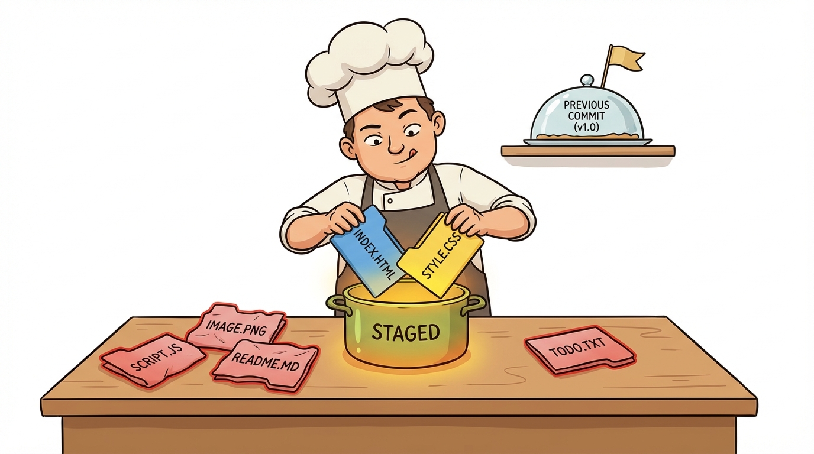
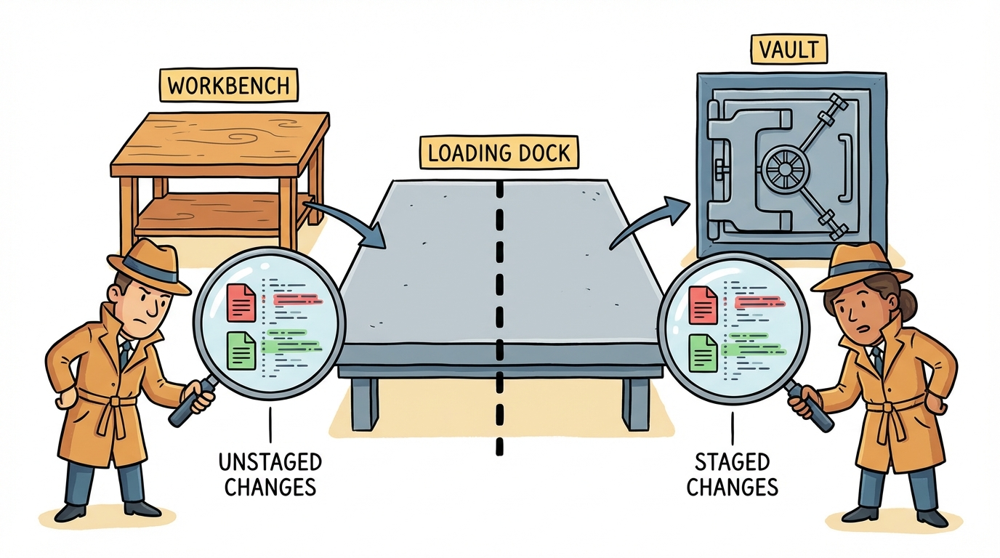

# Module 2: The Edit-Stage-Commit Workflow

## Introduction

> 🎙️ Yesterday you made your first commit. Today you'll learn the full edit-stage-commit workflow — the rhythm of Git that you'll use hundreds of times. By the end of today, you'll be tracking multiple files, staging selectively, and reading diffs like a pro.

> 🏷️ Start Here

> 🎯 **Teach:** The three-stage Git workflow and how to use git diff.
> **See:** Multiple files being tracked, staged selectively, and diffed.
> **Feel:** Comfortable with the daily rhythm of Git.

## The Three Stages of Git

> 🎯 **Teach:** Everything in Git flows through three stages — working directory, staging area, and repository.
> **See:** A diagram of the three stages and a table of key commands for each step.
> **Feel:** A clear mental picture of where your changes live at every point in the workflow.

> 🎙️ Everything in Git flows through three stages: the working directory (where you edit files), the staging area (where you prepare a commit), and the repository (where commits are stored permanently). Understanding this flow is the key to understanding Git.



The core Git workflow has three stages:

```
Working Directory  →  Staging Area  →  Repository
   (edit files)       (git add)       (git commit)
```

The staging area is what makes Git powerful — you can choose exactly which changes to include in a commit, even if you've modified multiple files.

### Key Commands

| Command | Purpose |
|---------|---------|
| `git status` | See what's changed |
| `git add <file>` | Stage a file |
| `git add .` | Stage all changes |
| `git commit -m "message"` | Commit staged changes |
| `git diff` | See unstaged changes |
| `git diff --staged` | See staged changes |

> 🔄 **Where this fits:** This is the daily workflow you'll use from now on. Every future module assumes you're comfortable with edit-stage-commit.

## Create Multiple Files

> 🎯 **Teach:** Git can track any number of files, and new files start as "untracked" until you stage them.
> **See:** Three new files created at once, all showing as untracked in `git status`.
> **Feel:** Comfortable working with multiple files in a single project.

> 🎙️ Real projects have many files. Let's create three files at once and see how Git handles them. Notice how they all show up as "untracked" — Git sees them, but it's not tracking them yet because you haven't told it to.

Use the `git-practice` repository you created on Day 1.

```bash
cd ~/git-practice
echo "This is file one." > file1.txt
echo "This is file two." > file2.txt
echo "This is file three." > file3.txt
git status
```

All three files should show as **untracked** in red.

## Stage Selectively

> 🎯 **Teach:** The staging area lets you choose exactly which files go into each commit.
> **See:** Two files staged (green) while the third remains untracked (red) in `git status`.
> **Feel:** The power of selective staging — you decide what goes together.

> 🎙️ Here's where the staging area shines. Instead of committing all three files at once, we're going to stage just two of them. This gives you control over what goes into each commit — a habit that makes your project history clean and meaningful.



```bash
git add file1.txt file2.txt
git status
```

`file1.txt` and `file2.txt` are now under "Changes to be committed" (green), while `file3.txt` is still "Untracked" (red).

## Commit and Stage the Remaining File

> 🎯 **Teach:** Each commit should represent one logical change — be intentional about what you group together.
> **See:** Two separate commits, each with a focused purpose.
> **Feel:** The satisfaction of a clean, well-organized commit history.

> 🎙️ Now commit those two staged files, and then separately stage and commit the third. This is the pattern: be intentional about what goes into each commit. Each commit should represent one logical change.

```bash
git commit -m "Add file1 and file2"
git status
```

### Stage and Commit the Remaining File

```bash
git add file3.txt
git commit -m "Add file3"
git status
```

> 💡 **Remember this one thing:** The staging area gives you control. You decide exactly what goes into each commit, even when you've changed many files.

## Modify a Tracked File

> 🎯 **Teach:** Git detects when a tracked file has been changed and reports it as "modified."
> **See:** Appending a line to `file1.txt` and seeing it marked as modified in `git status`.
> **Feel:** Aware that Git is watching your tracked files and catches every change.

> 🎙️ Now let's see what happens when you modify a file that's already tracked. Git knows the file changed because it's comparing your working copy to the last commit. This is different from an untracked file — Git is actively watching this one.

```bash
echo "Adding a second line to file one." >> file1.txt
git status
```

The file shows as **modified**.

## View the Diff

> 🎯 **Teach:** `git diff` shows exactly what changed, line by line, before you commit.
> **See:** The diff output with `+` lines for additions and `-` lines for deletions.
> **Feel:** Like a detective — you can inspect every change before locking it in.

> 🎙️ The `git diff` command shows you exactly what changed, line by line. Lines starting with `+` are additions, lines starting with `-` are deletions. This is one of the most useful commands in Git — always review your changes before committing.

```bash
git diff
```

Lines starting with `+` are additions, `-` are deletions.

## Stage and Diff Again

> 🎯 **Teach:** `git diff` shows unstaged changes while `git diff --staged` shows what's about to be committed.
> **See:** `git diff` going silent after staging, and `git diff --staged` revealing the staged changes.
> **Feel:** Sharp understanding of the difference between unstaged and staged — a key Git distinction.

> 🎙️ Here's a subtle but important detail. Once you stage a file, `git diff` shows nothing — because there are no more unstaged changes. To see what's staged and about to be committed, you need `git diff --staged`. Understanding this distinction is key.



```bash
git add file1.txt
git diff
git diff --staged
```

After staging:
- `git diff` shows **nothing** (no unstaged changes)
- `git diff --staged` shows the changes that **will** be committed

## Commit the Modification

> 🎯 **Teach:** A descriptive commit message explains what changed and why — not just "update file."
> **See:** A commit with a specific, meaningful message describing the modification.
> **Feel:** Disciplined — good commit messages are a gift to your future self.

> 🎙️ Everything looks good in the staged diff, so let's commit it. Notice how the commit message describes what changed — not just "update file" but specifically what was updated and why. Good commit messages are a gift to your future self.

```bash
git commit -m "Update file1 with second line"
```

## Make Multiple Changes, Commit Separately

> 🎯 **Teach:** Modifying several files but committing them separately creates a focused, readable history.
> **See:** Two files modified, then staged and committed one at a time.
> **Feel:** The professional habit of atomic commits becoming second nature.

> 🎙️ Here's where it gets powerful. You can modify several files but commit them separately, creating focused commits that each tell a clear story. This is a professional habit that makes your history much more useful when you need to understand what changed and when.

```bash
echo "Updated file two." >> file2.txt
echo "Updated file three." >> file3.txt
git status
```

Stage and commit separately:

```bash
git add file2.txt
git commit -m "Update file2"

git add file3.txt
git commit -m "Update file3"
```

## View the Full History

> 🎯 **Teach:** `git log` and `git log --oneline` let you review your entire commit history.
> **See:** Five commits displayed in both full and compact log formats.
> **Feel:** Accomplished — a clean history that tells the story of your work today.

> 🎙️ Let's step back and look at everything you've done today. The `git log` command shows your full commit history, and the `--oneline` flag gives you a compact view. You should see 5 commits — each one a clean, focused snapshot.

```bash
git log
git log --oneline
```

You should see 5 commits total.

> 💡 **Remember this one thing:** `git diff` shows unstaged changes. `git diff --staged` shows what's about to be committed. Use both to review your work before committing.

## Submission

> 🎯 **Teach:** How to save your work as proof of completion and what the grading rubric expects.
> **See:** The rubric with point values for selective staging, diffs, separate commits, and log output.
> **Feel:** Prepared and clear on exactly what to submit.

> 🎙️ Great work today! You've mastered the core Git workflow — the rhythm you'll use every day from here on out. Save your terminal output and check each item against the rubric below.

Save a file named `Day_02_Output.md` containing the terminal output from each task.

| Criteria | Points |
|----------|--------|
| Multiple files created and selectively staged | 15 |
| Separate commits for different files | 15 |
| File modified, diff viewed before and after staging | 25 |
| `git diff` vs `git diff --staged` difference demonstrated | 20 |
| Multiple changes committed separately | 15 |
| `git log` and `git log --oneline` output shown | 10 |
| **Total** | **100** |
