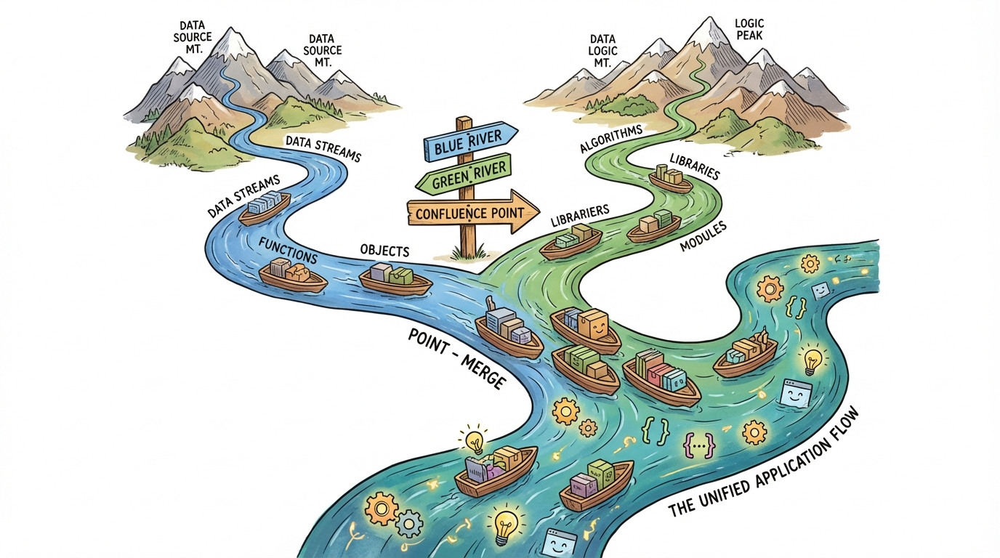
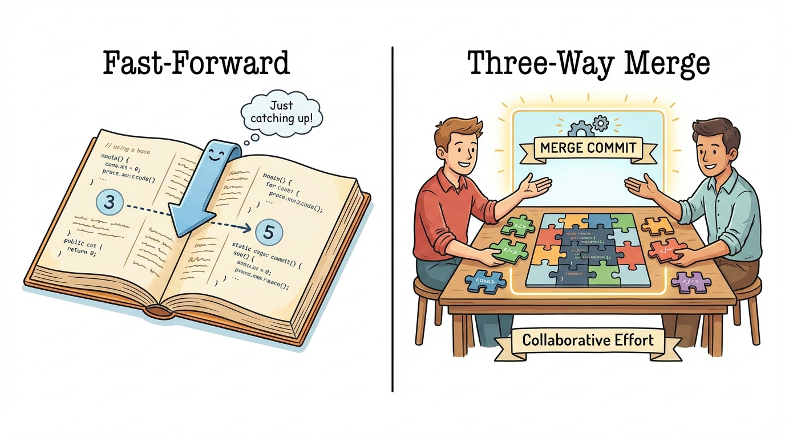
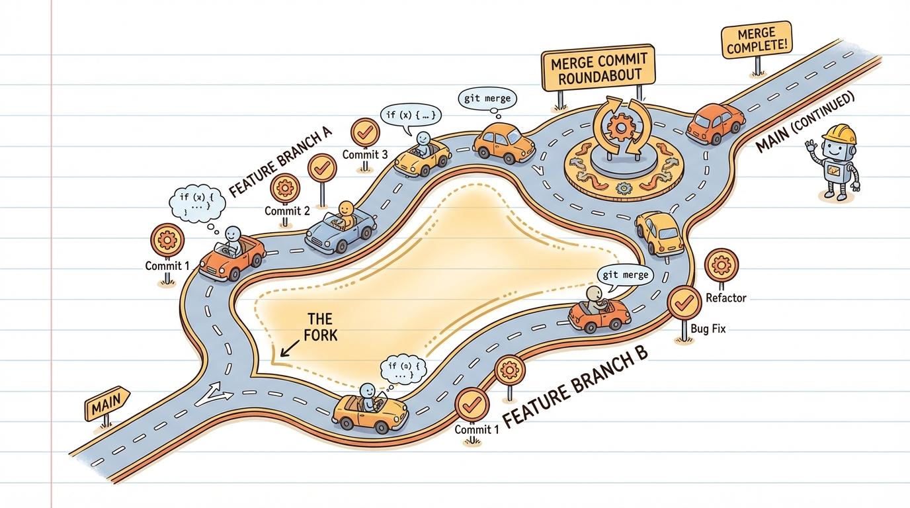

# Module 7: Merging Branches

## Introduction

> 🏷️ Useful Soon

> 🎯 **Teach:** How fast-forward and three-way merges work, and when each occurs.
> **See:** Both merge types in action, including the merge commit that a three-way merge creates.
> **Feel:** Confident that merging is predictable and safe when you understand what Git is doing.

> 🎙️ Yesterday you learned to create branches and work on them independently. But branches aren't useful if you can't bring the work back together. That's what merging does -- it combines the changes from one branch into another. Today you'll learn the two types of merges Git performs and what determines which one happens.



> 🔄 **Where this fits:** Branching (Day 6) and merging (today) are two halves of the same workflow. You branch to isolate work, you merge to integrate it. Starting from Day 8, you'll push these branches to GitHub and merge them through pull requests.

When you're done working on a branch, you **merge** it back into another branch (usually `main`). Git has two types of merges:

### Fast-Forward Merge

If `main` hasn't changed since the branch was created, Git just moves the `main` pointer forward:

```
Before:  main: A --- B
               feature: A --- B --- C --- D

After:   main: A --- B --- C --- D  (main moved to D)
```

No merge commit is created -- the history is linear.

### Three-Way Merge

If both branches have new commits, Git creates a **merge commit** that combines both:

```
Before:  main:    A --- B --- E
                           \
         feature:           C --- D

After:   main:    A --- B --- E --- M  (M is the merge commit)
                           \       /
         feature:           C --- D
```



## Set Up a Fresh Repo

> 🎯 **Teach:** Why starting with a clean repository makes merge examples easier to understand.
> **See:** A new repository initialized with a single commit on `main` as a clean starting point.
> **Feel:** Ready to focus on merging without distractions from leftover branches or history.

> 🎙️ Let's start with a clean repository so the merge examples are crystal clear. You won't have any leftover branches or commits to confuse things. Just a single initial commit on main as our starting point.

```bash
mkdir ~/merge-practice
cd ~/merge-practice
git init
echo "# Merge Practice" > README.md
git add README.md
git commit -m "Initial commit"
```

## Create a Feature Branch

> 🎯 **Teach:** How to set up a feature branch with commits while `main` stays unchanged -- the precondition for a fast-forward merge.
> **See:** Two commits on `add-homepage` while `main` remains at the initial commit.
> **Feel:** That isolating work on a branch is the natural first step before any merge.

> 🎙️ Now let's create a feature branch and add a couple of commits to it. Main won't move during this time, which sets us up for a fast-forward merge -- the simplest kind. Notice we're using switch with the dash-c flag to create and switch in one step.

```bash
git switch -c add-homepage
echo "<h1>Welcome</h1>" > index.html
git add index.html
git commit -m "Add homepage HTML"
```

```bash
echo "body { font-family: sans-serif; }" > style.css
git add style.css
git commit -m "Add stylesheet"
```

## Fast-Forward Merge

> 🎯 **Teach:** That a fast-forward merge simply moves the branch pointer forward -- no merge commit, no combining, no risk of conflict.
> **See:** Git reporting "Fast-forward" and the graph showing a straight line after the merge.
> **Feel:** That the simplest merge type is effortless and risk-free.

> 🎙️ A fast-forward merge is the simplest case. Main hasn't moved since the branch was created, so Git doesn't need to combine anything -- it just slides the main pointer forward to catch up with the feature branch. Watch for the words "Fast-forward" in the output.

```bash
git switch main
git log --oneline --all --graph
git merge add-homepage
git log --oneline --all --graph
```

Notice:
- Git says "Fast-forward" -- no merge commit was created
- `main` now points to the same commit as `add-homepage`
- The history is a straight line

## Clean Up After Fast-Forward

> 🎯 **Teach:** That branches should be deleted after merging to keep the repository tidy, and that `-d` is safe after a merge.
> **See:** The feature branch deleted cleanly with `git branch -d` because all its commits are in `main`.
> **Feel:** That branch cleanup is a healthy habit and part of a complete workflow.

> 🎙️ After a successful merge, the feature branch has served its purpose. Since all its commits are now part of main, the safe delete with dash-d works without complaint. Always clean up your branches after merging -- it keeps things tidy.

```bash
git branch -d add-homepage
git branch
```

The branch is safely deleted because all its commits are now part of `main`.

> 💡 **Remember this one thing:** A fast-forward merge happens when the target branch hasn't diverged. Git just moves the pointer -- no merge commit, no combining, no risk of conflict.

## Create Diverging Branches

> 🎯 **Teach:** What "divergence" means -- both branches have commits the other doesn't -- and why it triggers a three-way merge.
> **See:** A feature branch and `main` each receiving a commit after they split, creating a fork in the graph.
> **Feel:** That divergence is normal in team workflows and Git handles it gracefully.

> 🎙️ Now let's set up the more interesting case -- a three-way merge. For this, we need both branches to have commits that the other doesn't. We'll create a feature branch, add a commit, then go back to main and add a different commit. That creates a divergence.

```bash
git switch -c add-about
echo "<h1>About Us</h1>" > about.html
git add about.html
git commit -m "Add about page"
```

Now go back to `main` and make a different change:

```bash
git switch main
echo "<footer>Copyright 2025</footer>" >> index.html
git add index.html
git commit -m "Add footer to homepage"
```

## Visualize the Divergence

> 🎯 **Teach:** How to use the graph view to confirm that two branches have diverged before merging.
> **See:** Two lines splitting apart from a common ancestor in the `git log --graph` output.
> **Feel:** That visualizing the graph before merging helps you understand what Git will do.

> 🎙️ Before we merge, let's look at the graph. You should see two lines splitting apart from a common ancestor -- that's the divergence. Main has a commit that add-about doesn't, and add-about has a commit that main doesn't. Git will need to combine both.

```bash
git log --oneline --all --graph
```

You should see two branches diverging -- `main` and `add-about` each have commits the other doesn't.

## Three-Way Merge

> 🎯 **Teach:** How a three-way merge works -- Git finds the common ancestor, compares both sides, and creates a merge commit combining both.
> **See:** The merge commit appearing in the graph where the two branch lines come back together.
> **Feel:** That three-way merges are automatic and reliable when there are no conflicting changes.

> 🎙️ When you run git merge now, Git looks at three things: the common ancestor, the tip of main, and the tip of add-about. It figures out what changed on each side and combines them into a new merge commit. Your editor will open for the merge commit message -- just accept the default and save.



```bash
git merge add-about
```

Git will open your editor for a merge commit message. Accept the default message or write your own, then save and close.

```bash
git log --oneline --all --graph
```

You should see the merge commit where the branches come back together.

## Verify the Merge Result

> 🎯 **Teach:** How to confirm that a merge successfully combined work from both branches into the working directory.
> **See:** Files from both branches present in the working directory after the merge.
> **Feel:** Satisfied that merging brought everything together correctly -- nothing was lost.

> 🎙️ Let's confirm that the merge actually combined both lines of work. The working directory should have everything from both branches -- the footer from main and the about page from the feature branch. This is the whole point of merging.

```bash
ls
cat index.html
```

Both the footer (from `main`) and `about.html` (from the branch) are present. The merge combined both lines of work.

```bash
git branch -d add-about
```

## Create Two More Feature Branches

> 🎯 **Teach:** How to create multiple feature branches from `main` to simulate parallel development by different team members.
> **See:** Two independent branches created from `main`, each adding different files.
> **Feel:** That working on multiple features simultaneously is a natural part of Git workflows.

> 🎙️ In real projects, you'll often merge several branches into main one after another. Let's create two feature branches to see how sequential merging works. Each branch will start from main but add different files.

Create two feature branches from `main`:

```bash
git switch -c feature-nav
echo "<nav>Home | About | Contact</nav>" > nav.html
git add nav.html
git commit -m "Add navigation bar"
```

```bash
git switch main
git switch -c feature-contact
echo "<h1>Contact Us</h1>" > contact.html
git add contact.html
git commit -m "Add contact page"
```

## Merge Multiple Branches Sequentially

> 🎯 **Teach:** How merging multiple branches one after another works, and why the merge type may differ each time.
> **See:** The first merge possibly fast-forwarding while the second creates a merge commit, with the graph showing the result.
> **Feel:** Comfortable merging multiple branches and understanding the resulting history.

> 🎙️ Now we'll merge both branches into main one at a time. The first merge might fast-forward, the second will likely create a merge commit since main will have moved after the first merge. Watch the graph after each step to see how the history builds up.

```bash
git switch main
git merge feature-nav
git merge feature-contact
git log --oneline --graph --all
```

Notice how the first merge may fast-forward while the second creates a merge commit -- it depends on whether main moved between the two merges.

## Clean Up

> 🎯 **Teach:** That cleaning up merged branches and verifying the final state is the last step in a healthy merge workflow.
> **See:** Both feature branches deleted and all files from every branch present in `main`.
> **Feel:** That the merge workflow has a satisfying, complete cycle: branch, work, merge, clean up.

> 🎙️ Good housekeeping is part of a healthy Git workflow. Let's delete the feature branches and verify that everything landed in main. A quick ls confirms all the files from every branch are now together.

```bash
git branch -d feature-nav
git branch -d feature-contact
git branch
ls
```

All feature branch work is now in `main`, and the branches are cleaned up.

> 💡 **Remember this one thing:** Merging is how parallel work comes together. Fast-forward when main hasn't moved, three-way merge when it has. Either way, Git combines the work and keeps the full history.

## Submission

> 🎯 **Teach:** What complete, well-organized output looks like for grading, and how each rubric item maps to a merge exercise.
> **See:** A rubric table with point values covering both fast-forward and three-way merge demonstrations.
> **Feel:** Clear about what's expected and confident you can earn full marks by showing each merge type.

> 🎙️ Time to capture your work. Save all the terminal output from today's exercises into a single markdown file. Make sure each section is represented so the rubric items are clearly covered.

Save a file named `Day_07_Output.md` containing the terminal output from each task.

| Criteria | Points |
|----------|--------|
| Fast-forward merge completed and identified as fast-forward | 20 |
| Branch deleted after fast-forward merge | 5 |
| Diverging branches created for three-way merge | 15 |
| Three-way merge completed with merge commit | 20 |
| Merge result verified (both changes present) | 10 |
| Two feature branches merged sequentially | 20 |
| Branch graph shown at each stage | 10 |
| **Total** | **100** |
