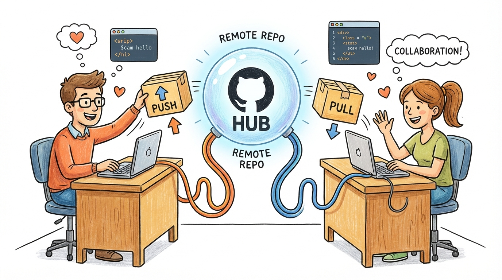
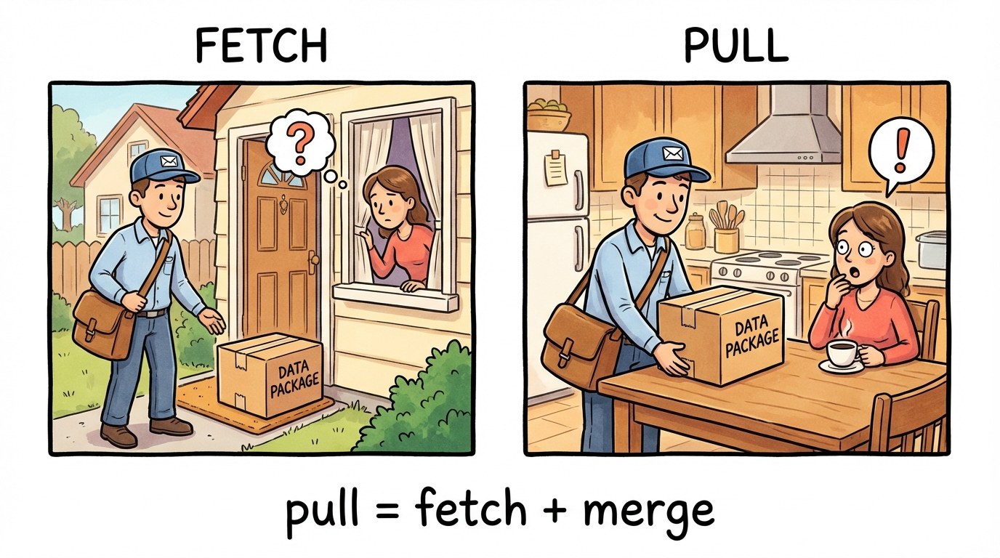
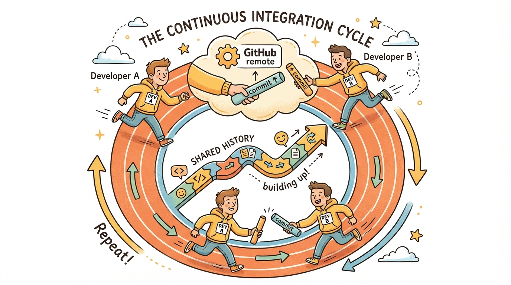

# Module 9: Clone, Fetch, and Pull

## Introduction

> 🏷️ Useful Soon

> 🎯 **Teach:** How cloning, fetching, and pulling work, and the difference between fetch and pull.
> **See:** Changes flowing between two local copies of the same repo through GitHub.
> **Feel:** That remote collaboration follows a predictable push-pull rhythm.

> 🎙️ Yesterday you pushed your repository to GitHub. Today you'll learn the other side of remote work -- cloning, fetching, and pulling. You'll simulate what collaboration actually looks like by cloning your own repo to a second location and passing changes back and forth. This is the same workflow you'd use with a teammate, just both sides are you.



> 🔄 **Where this fits:** Day 8 covered pushing to a remote. Today covers the receiving side -- cloning a repo, fetching updates, and pulling them in. Tomorrow (Day 10) brings it all together with the feature branch workflow that professional teams actually use.

## Clone vs Fork vs Fetch vs Pull

> 🎯 **Teach:** The precise differences between clone, fork, fetch, and pull -- four terms that are easily confused.
> **See:** A clear comparison table distinguishing what each operation does and when to use it.
> **Feel:** That the vocabulary is no longer confusing and you can use each term correctly.

> 🎙️ Before we dive in, let's get the vocabulary straight. These four terms come up constantly in Git conversations and it's easy to mix them up. Clone and fork are about getting a copy of a repo. Fetch and pull are about updating a copy you already have. The key difference between fetch and pull is whether the changes get merged automatically.



### Clone vs. Fork

- **`git clone`** -- Makes a local copy of a remote repository on your machine
- **Fork** -- A GitHub feature that creates a copy of someone else's repo under your own GitHub account

### Fetch vs. Pull

- **`git fetch`** -- Downloads new data from the remote but does NOT modify your working files. Safe to run anytime.
- **`git pull`** -- Does a `git fetch` PLUS a `git merge`. It updates your local branch with remote changes.

```
git pull = git fetch + git merge
```

The safer workflow is to `fetch` first, inspect the changes, then `merge` manually. But `git pull` is convenient for simple cases.

## Clone Your Own Repo

> 🎯 **Teach:** How `git clone` creates a complete local copy with full history and a pre-configured `origin` remote.
> **See:** Your GitHub repo cloned to a second folder, ready to push and pull immediately.
> **Feel:** That cloning is a one-command setup -- everything you need is automatically configured.

> 🎙️ Cloning creates a complete local copy of a remote repository -- all the files, all the history, all the branches. The clone automatically sets up origin pointing back to where it was cloned from, so it's ready to push and pull right away. You're going to clone your own repo to a second folder to simulate having a second developer.

Clone the repository you pushed to GitHub on Day 8 into a second location:

```bash
cd ~
git clone https://github.com/YOUR-USERNAME/git-fundamentals-practice.git git-practice-clone
cd git-practice-clone
```

Replace `YOUR-USERNAME` with your actual GitHub username.

## Inspect the Clone

> 🎯 **Teach:** How to verify that a clone has the full history, remote configuration, and remote-tracking branches.
> **See:** `git log`, `git remote -v`, and `git branch -a` confirming the clone is complete and connected.
> **Feel:** Reassured that cloning gives you everything -- no manual setup needed.

> 🎙️ Let's look at what git clone gave us. It should have the full commit history, a pre-configured origin remote, and remote-tracking branches. Everything is set up and ready to go -- no need to run git init or git remote add.

```bash
git log --oneline
git remote -v
git branch -a
```

The clone has the full history, `origin` is already configured, and you can see remote-tracking branches.

## Make a Change in the Original

> 🎯 **Teach:** How to simulate a teammate pushing changes by making a commit in the original repo and pushing it.
> **See:** A new file committed and pushed from `merge-practice` (Developer A's machine).
> **Feel:** That the push-pull collaboration cycle starts with someone pushing a change.

> 🎙️ Now you have two local copies of the same repo, both connected to the same GitHub remote. Think of merge-practice as Developer A's machine and git-practice-clone as Developer B's machine. Let's have Developer A make a change and push it, then see how Developer B gets that change.

```bash
cd ~/merge-practice
echo "New feature from developer A." > feature-a.txt
git add feature-a.txt
git commit -m "Developer A: add feature-a.txt"
git push
```

## Fetch from the Clone

> 🎯 **Teach:** That `git fetch` downloads new commits from the remote but does not change your local branches or working files.
> **See:** `origin/main` moving ahead of local `main` in the log after a fetch, while the working directory stays unchanged.
> **Feel:** That fetch is safe -- you can always see what's coming before you accept it.

> 🎙️ Now switch to Developer B's machine -- the clone. Running git fetch downloads the new commit from GitHub but doesn't change your working directory at all. You can see that origin/main has moved ahead of your local main, but your files haven't changed yet.

```bash
cd ~/git-practice-clone
git fetch origin
git log --oneline --all
```

You should see `origin/main` has moved ahead of your local `main`. The new commit is downloaded but not yet applied to your working directory.

## The File Isn't There Yet

> 🎯 **Teach:** The crucial distinction that fetch downloads data but does NOT modify your working directory.
> **See:** Running `ls` and confirming the new file is absent even though the commit was fetched.
> **Feel:** That this safety behavior is intentional and valuable -- fetch never surprises you.

> 🎙️ This is the crucial point about fetch -- it downloads data but does NOT change your files. If you list the directory right now, the new file won't be there. It exists in the remote-tracking branch origin/main, but your local main hasn't been updated yet. This is by design -- fetch is safe precisely because it doesn't touch your working directory.

```bash
ls
```

`feature-a.txt` is NOT in your working directory yet -- `fetch` only downloaded the data.

## Merge the Fetched Changes

> 🎯 **Teach:** How to apply fetched changes by merging `origin/main` into your local `main` -- the second step of the fetch-then-merge workflow.
> **See:** The new file appearing in the working directory after `git merge origin/main`.
> **Feel:** In control -- you inspected what was coming and chose when to apply it.

> 🎙️ Now let's apply those fetched changes by merging origin/main into your local main. After this merge, the file will appear in your working directory. This two-step fetch-then-merge workflow gives you full control -- you can inspect what's coming before you accept it.

```bash
git merge origin/main
ls
cat feature-a.txt
```

Now the file appears. This is the explicit fetch-then-merge workflow.

> 💡 **Remember this one thing:** `git fetch` is always safe -- it downloads but never changes your files. You can inspect what's new with `git log --all` before deciding to merge. This two-step approach gives you full control.

## Make Another Change

> 🎯 **Teach:** How to set up another round of changes to demonstrate `git pull` as a shortcut.
> **See:** Developer A pushing a second new file to GitHub.
> **Feel:** That the push-pull cycle is becoming familiar and repetitive -- which is the point.

> 🎙️ Let's do one more round, but this time we'll use git pull instead of the two-step process. Developer A will push another change, and Developer B will pull it in a single command.

```bash
cd ~/merge-practice
echo "Another feature from developer A." > feature-a2.txt
git add feature-a2.txt
git commit -m "Developer A: add feature-a2.txt"
git push
```

## Use git pull

> 🎯 **Teach:** That `git pull` combines fetch and merge into a single command -- convenient when you don't need to inspect first.
> **See:** The new file appearing immediately after `git pull` with no separate merge step.
> **Feel:** That `git pull` is the everyday shortcut, while fetch-then-merge is there when you need more control.

> 🎙️ Git pull does fetch and merge in one step. It's what most developers use day-to-day when they just want to grab the latest changes and there's no risk of conflict. Watch how the file appears immediately after the pull -- no separate merge step needed.

```bash
cd ~/git-practice-clone
git pull
ls
```

`git pull` fetched and merged in one step. `feature-a2.txt` should now be in your working directory.

## Push Back from Clone

> 🎯 **Teach:** That collaboration goes both directions -- any connected copy can push changes back to the shared remote.
> **See:** Developer B creating a file, committing it, and pushing it to GitHub from the clone.
> **Feel:** That you're a full participant in the collaboration cycle, not just a consumer of changes.

> 🎙️ Collaboration goes both directions. Developer B can push changes too. Let's create a file in the clone, commit it, and push it to GitHub. Then Developer A will be able to pull it down.

```bash
echo "Work from developer B." > feature-b.txt
git add feature-b.txt
git commit -m "Developer B: add feature-b.txt"
git push
```

## Pull into the Original

> 🎯 **Teach:** How to complete the collaboration cycle by pulling the clone's changes back into the original repo.
> **See:** Developer A pulling Developer B's file into the original `merge-practice` repo.
> **Feel:** That the full collaboration loop is complete -- changes flow freely in both directions.

> 🎙️ Now switch back to Developer A's machine and pull the change that Developer B just pushed. This completes the collaboration cycle -- changes flowing in both directions through a shared remote.

```bash
cd ~/merge-practice
git pull
ls
cat feature-b.txt
```

The change from "Developer B" is now in the original repo. This is the basic collaboration cycle: push from one side, pull from the other.

> 💡 **Remember this one thing:** `git pull` is `git fetch` + `git merge` in one command. Use it when you trust that the incoming changes won't conflict with your work. Use fetch-then-merge when you want to inspect first.

## View Unified History

> 🎯 **Teach:** That both developers' commits appear in a single shared history, which is the fundamental value of Git collaboration.
> **See:** `git log --graph` showing commits from both developers interleaved in one timeline.
> **Feel:** That Git ties everyone's work together into a coherent, traceable history.

> 🎙️ From either directory, the git log now shows commits from both developers interleaved in a single history. This is the whole point of Git as a collaboration tool -- everyone contributes to a shared history through a common remote, and the graph shows exactly how all the pieces fit together.



From either directory, view the unified history:

```bash
git log --oneline --graph --all
```

Both developers' commits are interleaved in the history. This is how Git enables collaboration -- everyone contributes to a shared, linear (or branching) history through a common remote.

## Submission

> 🎯 **Teach:** What complete, well-organized output looks like for grading, and how each rubric item maps to a clone/fetch/pull task.
> **See:** A rubric table with point values covering cloning, fetching, pulling, and bidirectional collaboration.
> **Feel:** Clear about what's expected and confident you can earn full marks by demonstrating the full collaboration cycle.

> 🎙️ Time to capture your work. Save all the terminal output from today's exercises into a single markdown file. Make sure each section is represented so the rubric items are clearly covered.

Save a file named `Day_09_Output.md` containing the terminal output from each task.

| Criteria | Points |
|----------|--------|
| Repository cloned to a second location | 10 |
| Clone inspected (log, remote, branches) | 10 |
| Change pushed from original repo | 10 |
| `git fetch` run and inspected (file not yet in working dir) | 15 |
| `git merge origin/main` used to apply fetched changes | 15 |
| `git pull` used as shortcut for fetch+merge | 15 |
| Change pushed from clone back to remote | 15 |
| Shared history viewed with `git log --graph` | 10 |
| **Total** | **100** |
