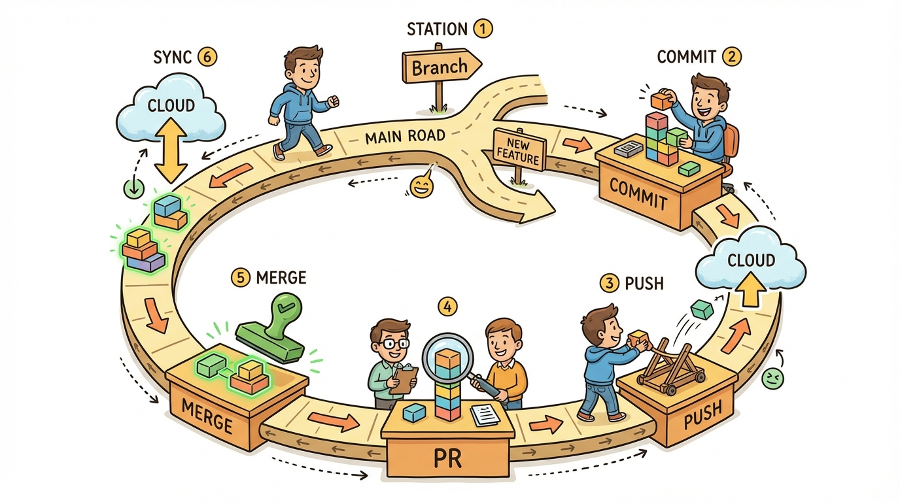
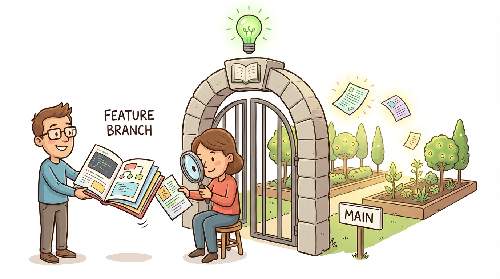
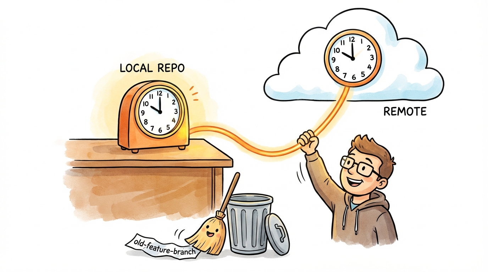

# Module 10: The Feature Branch Workflow

## Introduction

> 🏷️ When You're Ready

> 🎯 **Teach:** The complete feature branch workflow used by professional teams.
> **See:** A branch pushed to GitHub, a pull request opened and merged, and local cleanup afterward.
> **Feel:** Ready to participate in a real team's Git workflow.

> 🎙️ This is where everything comes together. Over the past nine days, you've learned repositories, commits, branches, merges, and remotes. Today you'll combine all of that into the feature branch workflow -- the standard way professional teams write software.

> 🔄 **Where this fits:** Days 6-7 taught branching and merging locally. Days 8-9 taught pushing and pulling. Today combines them into the workflow you'll use every day on a real team: branch, commit, push, PR, merge, sync, repeat.

## The Feature Branch Workflow

> 🎯 **Teach:** The six-step loop that every feature follows from branch creation to cleanup.
> **See:** A diagram of the feature branch workflow steps: branch, commit, push, PR, merge, sync.
> **Feel:** Confident that this loop is simple and repeatable -- not a complicated process.

> 🎙️ In real-world projects, you rarely push directly to main. Instead, every change follows a loop: create a branch, make commits, push, open a pull request, merge, and sync. This loop is called the feature branch workflow, and it's the heartbeat of modern software development.



In real-world projects, you rarely push directly to `main`. Instead, you:

1. Create a **feature branch**
2. Make commits on the branch
3. **Push** the branch to the remote
4. Open a **Pull Request (PR)** on GitHub
5. Get the PR reviewed and **merged**
6. **Delete** the branch and pull the updated `main`

This is called the **feature branch workflow**. Pull requests are a GitHub feature (not a Git feature) that let teams review code before it's merged.

## Create and Push a Feature Branch

> 🎯 **Teach:** How to create a local feature branch and push it to GitHub for the first time.
> **See:** A new branch created, a commit made, and `git push -u` sending it to the remote.
> **Feel:** Excited that your branch now exists on GitHub for others to see.

> 🎙️ The first step is to create a branch for your work and push it to GitHub. When you push a branch, it appears on the remote as a separate branch that others can see and review. You push the branch the same way you push main -- with git push and the dash-u flag the first time.

```bash
cd ~/merge-practice
git switch -c feature-login
echo "<form>Username: <input></form>" > login.html
git add login.html
git commit -m "Add login page HTML"
```

Push the branch to GitHub:

```bash
git push -u origin feature-login
```

Go to your GitHub repository in a browser. You should see a banner saying "feature-login had recent pushes" with a button to create a pull request.

## Add More Commits to the Branch

> 🎯 **Teach:** That feature branches typically have multiple commits, and subsequent pushes don't need the `-u` flag.
> **See:** A second commit pushed to the same branch with a simple `git push`.
> **Feel:** Comfortable with the rhythm of commit-and-push on a feature branch.

> 🎙️ A feature branch usually has more than one commit. You keep working, committing, and pushing. After the first push with dash-u, every subsequent push is just git push -- no extra flags needed because the tracking relationship is already set up.

```bash
echo "form { padding: 20px; }" > login.css
git add login.css
git commit -m "Add login page styles"
git push
```

The second `git push` doesn't need `-u` since the tracking is already set up.

## Open a Pull Request on GitHub

> 🎯 **Teach:** What a pull request is and how to create one on GitHub.
> **See:** The GitHub PR creation form with base branch, compare branch, title, and description.
> **Feel:** Like a real developer proposing changes through the proper channel.

> 🎙️ A pull request is how you propose merging your branch into main. It's not a Git feature -- it's a GitHub feature built on top of Git. A PR shows the diff of all your changes, lets reviewers leave comments, and provides a merge button. This is where code review happens on real teams.



1. Go to your repository on GitHub
2. Click **"Compare & pull request"** (or go to the Pull Requests tab and click New Pull Request)
3. Set the base branch to `main` and the compare branch to `feature-login`
4. Write a title: `Add login page`
5. Write a description explaining what the PR adds
6. Click **Create pull request**

## Review the PR

> 🎯 **Teach:** How to review a PR's diff using the Files Changed tab before merging.
> **See:** The Files Changed tab showing line-by-line diffs and the ability to leave comments.
> **Feel:** Appreciation for the code review process as a quality safeguard.

> 🎙️ Before merging, take a moment to review the PR yourself. The Files Changed tab shows a diff of every line you touched. On a real team, a colleague would review this and leave comments. Get in the habit of reviewing your own work here -- it catches mistakes before they hit main.

On the PR page:
1. Click the **"Files changed"** tab to see the diff
2. Notice you can leave line-by-line comments
3. Go back to the **"Conversation"** tab

## Merge the PR on GitHub

> 🎯 **Teach:** How to merge a PR and delete the remote branch on GitHub.
> **See:** The green merge button, the confirmation, and the delete-branch cleanup.
> **Feel:** Satisfaction that your code is now officially part of main.

> 🎙️ Once the review looks good, it's time to merge. GitHub gives you a big green button for this. After merging, GitHub will offer to delete the remote branch -- do it. The branch has served its purpose, and keeping it around just creates clutter.

1. Click **"Merge pull request"**
2. Click **"Confirm merge"**
3. Click **"Delete branch"** to clean up the remote branch

> 💡 **Remember this one thing:** Pull requests are the gateway for code entering main on a team. They provide a place for review, discussion, and automated checks before code is merged. Get comfortable with this flow -- you'll do it hundreds of times.

## Update Your Local Main

> 🎯 **Teach:** Why your local main falls behind after a remote merge, and how to sync it.
> **See:** `git switch main` followed by `git pull` bringing the merged changes down.
> **Feel:** Awareness that local and remote are separate copies that must be kept in sync.

> 🎙️ After merging on GitHub, your remote main has moved forward but your local main is still behind. You need to switch back to main and pull the latest changes. This is how you keep your local copy in sync with the remote.



```bash
git switch main
git pull
ls
```

`login.html` and `login.css` should now be on `main` locally.

## Delete the Local Branch

> 🎯 **Teach:** How to safely delete a merged local branch with `git branch -d`.
> **See:** The branch removed from the local branch list after deletion.
> **Feel:** Good hygiene habits forming -- clean up after every merge.

> 🎙️ Your feature-login branch was merged on GitHub, so you don't need the local copy anymore either. Deleting it with dash-d is safe -- Git will only let you delete a branch whose commits are already part of another branch. It's good hygiene to clean up after every merge.

```bash
git branch -d feature-login
git branch
```

The branch is safely deleted because its commits are now part of `main`.

## Prune Remote-Tracking Branches

> 🎯 **Teach:** What stale remote-tracking branches are and how to clean them up with `git fetch --prune`.
> **See:** Ghost branches in `git branch -a` disappearing after the prune command.
> **Feel:** In control of your branch list -- no clutter, no confusion.

> 🎙️ Even though the remote branch was deleted on GitHub, your local Git still remembers it as a remote-tracking branch. The fetch dash dash prune command cleans up these stale references. Without this step, you'll accumulate ghost branches that clutter your branch list.

The remote branch was deleted on GitHub, but your local Git still remembers it:

```bash
git branch -a
```

You'll see `remotes/origin/feature-login` still listed. Clean it up:

```bash
git fetch --prune
git branch -a
```

Now the stale remote-tracking branch is gone.

## Full Cycle Practice

> 🎯 **Teach:** Reinforcement of the complete workflow through a second independent cycle.
> **See:** The entire branch-commit-push-PR-merge cycle repeated with a footer feature.
> **Feel:** Growing muscle memory -- the workflow is becoming automatic.

> 🎙️ That was the complete workflow: branch, commit, push, PR, merge, sync, clean up. The best way to make it second nature is to do it again. This time, try to do it faster -- you already know all the steps. Repetition is what turns knowledge into muscle memory.

Practice the full cycle one more time:

```bash
git switch -c feature-footer
echo "<footer>© 2025 My Site</footer>" > footer.html
git add footer.html
git commit -m "Add footer component"
git push -u origin feature-footer
```

Then on GitHub:
1. Create a pull request
2. Merge it
3. Delete the remote branch

## Merge and Sync Again

> 🎯 **Teach:** The post-merge sync and cleanup steps, reinforced through repetition.
> **See:** `git pull`, `git branch -d`, and `git fetch --prune` completing the cycle a second time.
> **Feel:** Familiarity -- this cleanup routine is becoming second nature.

> 🎙️ Now bring everything back to your local machine just like before. Switch to main, pull, delete the branch, and prune. This is the same cleanup you did earlier -- by the second time through, it should already feel familiar.

Back in the terminal:

```bash
git switch main
git pull
git branch -d feature-footer
git fetch --prune
git log --oneline -5
```

> 💡 **Remember this one thing:** The feature branch workflow is: branch, commit, push, PR, merge, pull, clean up. This cycle is the heartbeat of modern software development. Every feature, bug fix, and improvement follows this same loop.

## Submission

> 🎯 **Teach:** How to document and submit evidence of completing the workflow exercises.
> **See:** A checklist of required terminal output and GitHub screenshots.
> **Feel:** Accomplishment from completing both full feature branch cycles.

> 🎙️ Time to capture your work. Save your terminal output and GitHub screenshots into a single file. Make sure you have evidence of both full cycles -- the login feature and the footer feature.

Save a file named `Day_10_Output.md` containing terminal output and screenshots of the GitHub PR process.

| Criteria | Points |
|----------|--------|
| Feature branch created and pushed to remote | 15 |
| Additional commits pushed to the branch | 10 |
| Pull request created on GitHub | 15 |
| PR diff reviewed on Files Changed tab | 10 |
| PR merged on GitHub | 15 |
| Local main updated with `git pull` | 10 |
| Local and remote branches cleaned up | 10 |
| Full cycle repeated independently | 15 |
| **Total** | **100** |
