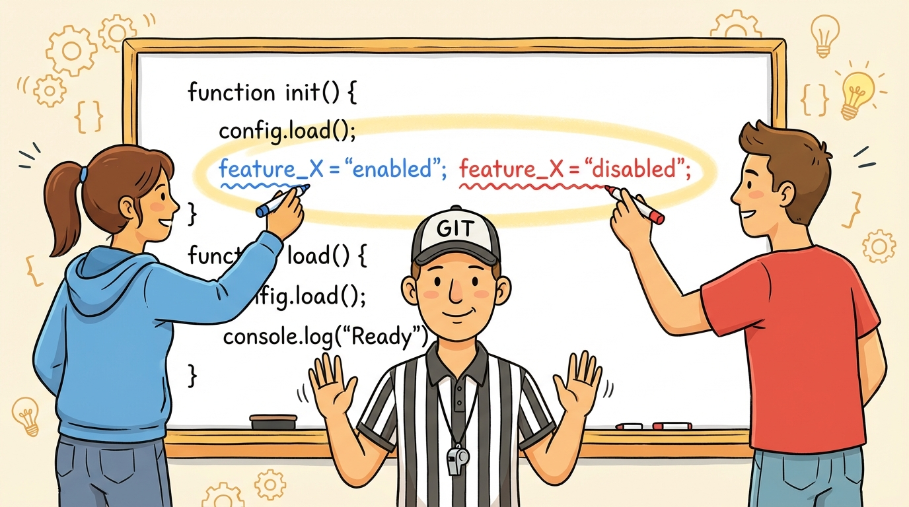
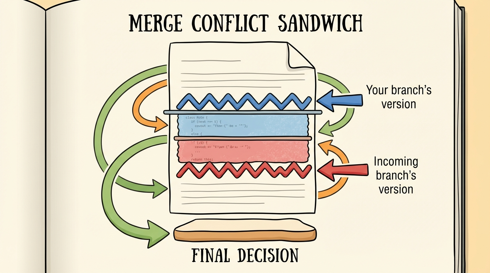
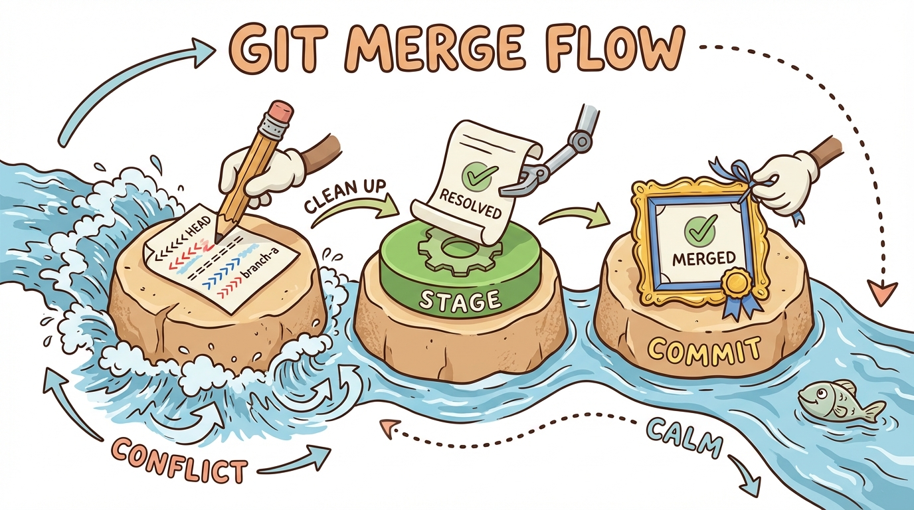

# Module 11: Merge Conflicts

## Introduction

> 🏷️ When You're Ready

> 🎯 **Teach:** How merge conflicts happen, what conflict markers mean, and how to resolve them.
> **See:** Conflicts being created, inspected, and resolved step by step.
> **Feel:** Confident that conflicts are routine and manageable, not something to fear.

> 🎙️ Merge conflicts sound scary, but they're actually one of the most normal things in Git. A conflict just means two people -- or two branches -- changed the same line in the same file, and Git needs you to decide which version wins. Once you've resolved a few, it becomes second nature.



> 🔄 **Where this fits:** You already know how to branch and merge from Days 6 and 7. Now you'll handle the cases where Git can't automatically combine changes -- the skill that separates beginners from confident Git users.

## What Is a Conflict?

> 🎯 **Teach:** The precise condition that causes a merge conflict -- two branches modifying the same lines.
> **See:** A clear explanation of when Git can auto-merge and when it cannot.
> **Feel:** Understanding that conflicts are logical, not random -- they happen for a specific reason.

> 🎙️ A merge conflict happens when two branches modify the same lines of the same file. Git can automatically merge changes to different files or different parts of the same file, but when changes overlap, it stops and asks you to decide. Think of it as Git saying, "I don't want to guess -- you tell me what's right."

A **merge conflict** happens when two branches modify the **same lines** of the **same file**. Git can automatically merge changes to different files or different parts of the same file, but when changes overlap, you need to decide which version to keep.

## Understanding Conflict Markers

> 🎯 **Teach:** How to read the three conflict marker lines and what each section represents.
> **See:** The `<<<<<<<`, `=======`, and `>>>>>>>` markers with labeled sections.
> **Feel:** Able to parse conflict markers at a glance without confusion.

> 🎙️ When Git hits a conflict, it marks the file with special lines that show you both versions side by side. Learning to read these markers is the key skill here. Once you can parse them at a glance, resolving conflicts becomes mechanical.



When a conflict occurs, Git marks the file with **conflict markers**:

```
<<<<<<< HEAD
This is the version on your current branch.
=======
This is the version from the branch being merged.
>>>>>>> feature-branch
```

Here's how to read the markers:

- Everything between `<<<<<<< HEAD` and `=======` is **your current branch's** version
- Everything between `=======` and `>>>>>>>` is the **incoming branch's** version
- You resolve the conflict by editing the file to keep what you want, removing all the markers, then staging and committing

## Set Up a Fresh Repo

> 🎯 **Teach:** How to create a controlled environment for practicing merge conflicts.
> **See:** A new repo initialized with a simple multi-line file ready for conflicting edits.
> **Feel:** Prepared to experiment safely in a sandbox where nothing can go wrong.

> 🎙️ The best way to understand conflicts is to create one on purpose. Let's set up a fresh repo with a simple file that we can modify on two different branches. This gives us a clean playground where we control exactly what conflicts happen.

```bash
mkdir ~/conflict-practice
cd ~/conflict-practice
git init
echo "Line 1: Original content" > shared.txt
echo "Line 2: This line stays the same" >> shared.txt
echo "Line 3: Original ending" >> shared.txt
git add shared.txt
git commit -m "Initial version of shared.txt"
```

## Modify the Same Line on Two Branches

> 🎯 **Teach:** How conflicting changes are created by editing the same line on separate branches.
> **See:** Line 1 changed to different values on `branch-a` and `main`.
> **Feel:** Clear understanding of exactly why Git will be unable to auto-merge.

> 🎙️ Now we'll create the conditions for a conflict. We'll change line 1 on a new branch, then go back to main and change the same line differently. When we try to merge, Git will see that both branches touched the same line and won't know which version to keep.

Create a branch and change line 1:

```bash
git switch -c branch-a
sed -i 's/Line 1: Original content/Line 1: Changed by Branch A/' shared.txt
git add shared.txt
git commit -m "Branch A: modify line 1"
```

Go back to `main` and change the same line differently:

```bash
git switch main
sed -i 's/Line 1: Original content/Line 1: Changed by Main/' shared.txt
git add shared.txt
git commit -m "Main: modify line 1"
```

## Attempt the Merge

> 🎯 **Teach:** What happens when Git encounters a conflict during a merge -- the merge pauses, not fails.
> **See:** The `CONFLICT` message from `git merge` and the paused merge state.
> **Feel:** Calm -- the merge is paused, not broken. Git is waiting for your help.

> 🎙️ Here's the moment of truth. When you run git merge, Git will try to combine the changes automatically. But since both branches changed the same line, it can't. Git will report a conflict and pause the merge, waiting for you to step in and fix things.

```bash
git merge branch-a
```

Git will report: **CONFLICT (content): Merge conflict in shared.txt**. The merge is paused -- it needs your help.

## Inspect the Conflict

> 🎯 **Teach:** How to use `git status` and file inspection to understand the scope of a conflict.
> **See:** The "both modified" status and the actual conflict markers inside the file.
> **Feel:** In control -- you can see exactly what needs to be fixed.

> 🎙️ Don't panic when you see that conflict message. Git has paused the merge and is waiting for you to tell it what to do. Let's look at the file and see exactly what Git is showing us. The status command will tell you which files are conflicted, and the file itself will have those markers we just learned about.

```bash
git status
cat shared.txt
```

`git status` shows `shared.txt` as "both modified." The file contents show the conflict markers. Read them carefully -- they tell you exactly what each branch wanted.

## Resolve the Conflict

> 🎯 **Teach:** The hands-on process of editing a file to remove conflict markers and choose the final content.
> **See:** Multiple resolution strategies -- keeping one side, combining both, or writing something new.
> **Feel:** Empowered to make the decision -- you're the human Git is deferring to.

> 🎙️ Resolving the conflict is just editing a text file. Remove the markers, decide what the final version should be, and save. You can keep one side, keep the other, or combine both -- it's entirely up to you. The only rule is that all the marker lines must be gone when you're done.

Open `shared.txt` in your editor and resolve it. Remove the conflict markers and decide what the final version should be. For example, you might combine both changes:

```
Line 1: Changed by Main and Branch A
Line 2: This line stays the same
Line 3: Original ending
```

Or pick one side:

```
Line 1: Changed by Main
Line 2: This line stays the same
Line 3: Original ending
```

The key rule: **remove all `<<<<<<<`, `=======`, and `>>>>>>>` lines** and leave the file in the correct final state.

## Complete the Merge

> 🎯 **Teach:** The three-step finish: edit the file, `git add`, and `git commit` to complete the merge.
> **See:** The resolved file staged, the merge commit created, and the graph showing branches joined.
> **Feel:** Satisfaction from successfully resolving your first conflict.

> 🎙️ After editing the file, you need to tell Git you're done resolving. Stage the file with git add, then commit. This merge commit records that you combined both branches and made a decision about the conflict. Check the graph afterward to see both branches joining together.



```bash
git add shared.txt
git commit -m "Merge branch-a: resolve conflict in shared.txt"
git log --oneline --graph --all
```

The merge commit records that both branches were combined and the conflict was resolved.

> 💡 **Remember this one thing:** Resolving a conflict is a three-step process: **edit the file** to remove markers, **`git add`** the resolved file, and **`git commit`** to finish the merge. That's it.

## Create Multi-File Conflicts

> 🎯 **Teach:** That real merges can produce conflicts in multiple files simultaneously.
> **See:** Two files (`header.txt` and `content.txt`) both created with conflicting content on separate branches.
> **Feel:** Prepared for real-world scenarios where conflicts span multiple files.

> 🎙️ In real projects, a merge can produce conflicts in more than one file at the same time. The process is exactly the same -- you just resolve each file individually before staging and committing. Let's create a scenario with two conflicting files.

```bash
git switch -c branch-b
echo "Branch B header" > header.txt
echo "Branch B content" > content.txt
git add header.txt content.txt
git commit -m "Branch B: add header and content"

git switch main
echo "Main header" > header.txt
echo "Main content" > content.txt
git add header.txt content.txt
git commit -m "Main: add header and content"
```

## Resolve Multiple Conflicts

> 🎯 **Teach:** How to resolve each conflicted file individually, then stage and commit them all at once.
> **See:** Both files resolved, staged together, and committed in a single merge commit.
> **Feel:** Confident that multi-file conflicts are just single-file conflicts repeated.

> 🎙️ When you merge now, both files will have conflicts. Git status will list every conflicted file. You resolve them one at a time -- open each file, remove the markers, save -- then stage them all and commit once. One merge commit covers all the resolved files.

```bash
git merge branch-b
git status
```

Both files have conflicts. Resolve each one:

```bash
cat header.txt
# Edit header.txt to resolve the conflict
cat content.txt
# Edit content.txt to resolve the conflict
```

After editing both files to remove all conflict markers:

```bash
git add header.txt content.txt
git commit -m "Merge branch-b: resolve conflicts in header and content"
git log --oneline --graph --all
```

Every conflicting file must be resolved and staged before you can complete the merge commit.

## Start a Conflict and Abort

> 🎯 **Teach:** How `git merge --abort` cancels a merge in progress and restores the pre-merge state.
> **See:** A conflict triggered, then cleanly aborted with everything back to normal.
> **Feel:** Relief that you always have a safe escape hatch if a merge gets overwhelming.

> 🎙️ Sometimes you start a merge, see the conflicts, and realize you're not ready to deal with them yet. Maybe you need to think about the right approach, or maybe you merged the wrong branch. No problem -- git merge dash dash abort takes you right back to where you started. Nothing is lost.


```bash
git switch -c branch-c
echo "Branch C version" > abort-test.txt
git add abort-test.txt
git commit -m "Branch C: add abort-test"

git switch main
echo "Main version" > abort-test.txt
git add abort-test.txt
git commit -m "Main: add abort-test"

git merge branch-c
git status
```

Instead of resolving, abort:

```bash
git merge --abort
git status
cat abort-test.txt
```

Everything is back to the way it was before the merge attempt. No harm done.

> 💡 **Remember this one thing:** `git merge --abort` is your safety net. If a merge gets messy and you want to start over, abort and try again when you're ready.

## Submission

> 🎯 **Teach:** How to document conflict resolution work for submission.
> **See:** A checklist of required outputs including conflict markers, resolutions, and graph output.
> **Feel:** Accomplishment from mastering one of Git's most intimidating topics.

> 🎙️ Time to save your work. Capture all the terminal output from today's exercises -- the conflict creation, the markers, the resolution, the multi-file conflicts, and the abort. This is one of those modules where the output really tells the story.

Save a file named `Day_11_Output.md` containing the terminal output from each task.

| Criteria | Points |
|----------|--------|
| Conflicting changes created on two branches | 15 |
| Conflict markers identified and explained | 15 |
| Single-file conflict resolved cleanly | 20 |
| Merge commit created after resolution | 10 |
| Multi-file conflict created and resolved | 20 |
| Merge aborted with `git merge --abort` | 10 |
| Branch graph shown after each merge | 10 |
| **Total** | **100** |
